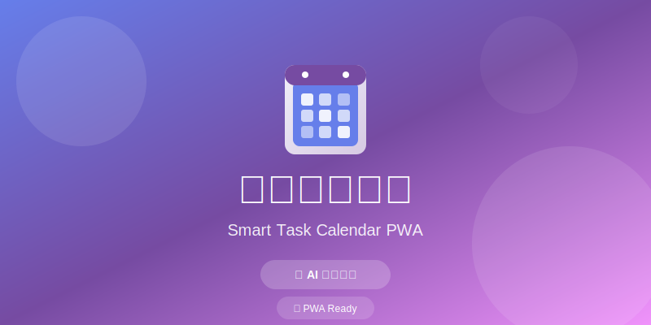

# 🗓️ 智能任务日历 PWA

<div align="center">
  
</div>

<div align="center">

   

**一个现代化的智能任务日历应用，支持离线使用和 PWA 安装**

[在线演示](#) · [功能特性](#功能特性) · [快速开始](#快速开始) · [项目结构](#项目结构)

</div>


## 🤖 AI 辅助开发

本项目由 **AI 辅助开发**，采用了现代化的开发实践和代码规范。AI 在以下方面提供了重要支持：

- ✨ **渐进式重构**：采用模块化设计，逐步优化代码结构
- 🎨 **UI/UX 设计**：使用 Tailwind CSS 构建现代化、响应式界面
- 🔧 **代码优化**：实现命名空间封装、数据验证、本地存储等最佳实践
- 🐛 **问题解决**：快速定位并修复日期处理、模态框交互等技术难题
- 📱 **PWA 功能**：实现离线支持、应用安装等 Progressive Web App 特性

## ✨ 功能特性

### 📅 日历管理
- **月视图日历**：直观的月历视图，支持任务快速查看
- **日期导航**：轻松切换月份，快速定位特定日期
- **今日高亮**：自动标识当天日期

### ✅ 任务管理
- **创建任务**：支持添加任务标题、描述和优先级
- **任务过滤**：按全部、待办、已完成状态筛选任务
- **任务编辑**：修改任务内容和状态
- **任务删除**：删除不需要的任务
- **优先级标识**：通过颜色区分任务优先级

### 🎨 界面设计
- **玻璃拟态设计**：现代感的毛玻璃效果
- **渐变配色**：精美的渐变色彩方案
- **响应式布局**：完美适配桌面和移动设备
- **流畅动画**：平滑的过渡和交互效果

### 📱 PWA 功能
- **离线支持**：Service Worker 实现离线访问
- **应用安装**：支持安装到桌面和主屏幕
- **快速启动**：独立的窗口运行体验


## 🚀 快速开始

### 环境要求
- 现代浏览器（Chrome、Firefox、Safari、Edge）
- 本地 Web 服务器（用于 PWA 功能测试）

### 安装步骤

1. **克隆项目**
```bash
git clone https://github.com/yourusername/work-calendar-pwa.git
cd work-calendar-pwa
```

2. **启动本地服务器**

使用 Python：
```bash
# Python 3
python -m http.server 8000

# Python 2
python -m SimpleHTTPServer 8000
```

或使用 Node.js：
```bash
npx http-server -p 8000
```

3. **访问应用**
打开浏览器访问 `http://localhost:8000`

4. **安装 PWA**
- 在支持的浏览器中，点击地址栏的安装图标
- 或使用应用的"安装应用"按钮


## 📁 项目结构

```
work-calendar-pwa/
├── index.html          # 主页面
├── manifest.json       # PWA 清单文件
├── sw.js              # Service Worker（离线支持）
├── favicon.svg        # 应用图标
├── style.css          # 全局样式
├── main.js            # 核心应用逻辑
├── config.js          # 应用配置
├── constants.js       # 常量定义
├── validators.js      # 数据验证
├── storage.js         # 本地存储管理
├── dialog.js          # 自定义对话框
└── README.md          # 项目文档
```

### 核心模块说明

| 文件 | 功能 |
|------|------|
| **main.js** | 应用主逻辑，包含日历渲染、任务管理等核心功能 |
| **storage.js** | 基于 localStorage 的数据持久化层 |
| **validators.js** | 表单验证和数据校验工具 |
| **dialog.js** | 自定义模态框和确认对话框组件 |
| **constants.js** | 应用常量和配置参数 |
| **config.js** | 应用配置和初始化设置 |


## 🛠️ 技术栈

- **前端框架**：原生 JavaScript（Vanilla JS）
- **样式框架**：Tailwind CSS（实用优先的 CSS 框架）
- **PWA 技术**：Service Worker、Web App Manifest
- **数据存储**：localStorage API
- **图标**：SVG 矢量图标


## 📖 使用说明

### 创建任务
1. 点击"新建任务"按钮
2. 填写任务标题和描述（可选）
3. 选择优先级（高/中/低）
4. 点击"保存"按钮

### 管理任务
- **查看任务**：点击日历上的日期查看当日任务
- **完成任务**：点击任务卡片上的复选框
- **编辑任务**：点击任务卡片上的编辑图标
- **删除任务**：点击任务卡片上的删除图标

### 过滤任务
使用顶部的过滤按钮：
- **全部**：显示所有任务
- **待办**：仅显示未完成的任务
- **已完成**：仅显示已完成的任务


## 🔧 开发说明

### 代码规范
- 采用模块化设计，功能分离
- 使用命名空间封装（`App` 对象）
- 遵循渐进式重构原则
- 优先使用 Tailwind CSS 实用类

### 数据验证
- 任务标题：1-50 个字符
- 任务描述：最多 200 个字符
- 日期格式：YYYY-MM-DD

### 本地存储
- 数据存储在 `workCalendarTasks` 键下
- 自动保存任务数据
- 支持数据持久化


## 🎯 未来计划

- [ ] 任务提醒功能
- [ ] 任务分类和标签
- [ ] 数据导出/导入
- [ ] 多语言支持
- [ ] 深色模式
- [ ] 任务统计和分析
- [ ] 云端同步


## 📝 更新日志

### v1.0.0 (2025-12-27)
- ✨ 初始版本发布
- ✅ 完整的任务管理功能
- 📱 PWA 支持
- 🎨 现代化 UI 设计
- 🔄 离线功能支持


## 🤝 贡献

欢迎提交 Issue 和 Pull Request！


## 📄 许可证

本项目采用 MIT 许可证 - 详见 [LICENSE](LICENSE) 文件


## 🙏 致谢

感谢所有为这个项目做出贡献的开发者和 AI 助手！


<div align="center">

**Made with ❤️ and AI Assistance**

[⬆ 回到顶部](#-智能任务日历-pwa)

</div>
